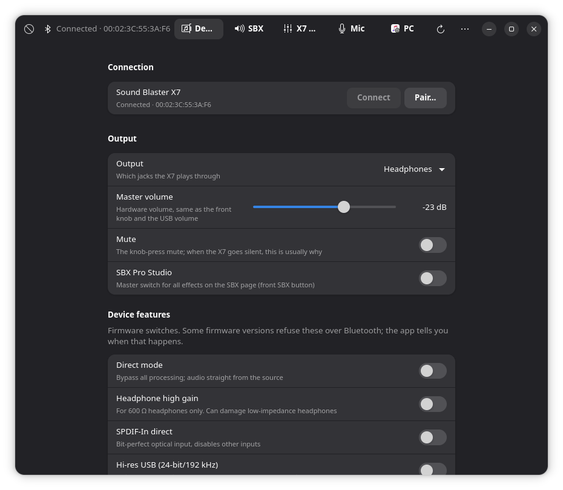
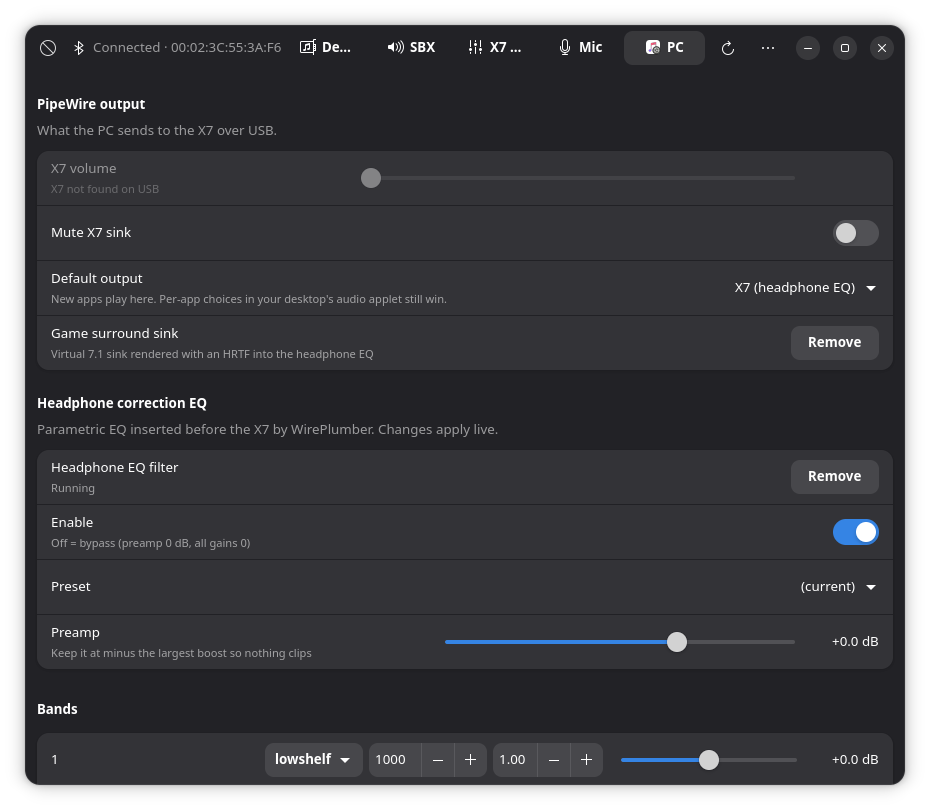

# X7 Control

Control a **Creative Sound Blaster X7** from Linux. Creative's phone app is gone from the
stores and there was never a Linux one; this talks to the box over Bluetooth using the same
protocol the app used, and adds the PC-side pieces (headphone EQ, game surround, voice-only
microphone) as PipeWire filters.

| Device page (talking to the X7) | PC page (PipeWire EQ, surround, voice filter) |
|---|---|
|  |  |

Not affiliated with or endorsed by Creative Technology Ltd.

## What it does

**On the X7 itself (over Bluetooth)**

- Output routing: headphones, stereo speakers, 5.1 speakers
- Master volume in dB, and the knob-press mute (the usual reason an X7 "goes silent")
- SBX Pro Studio: Surround, Crystalizer, Bass with crossover, Smart Volume, Dialog Plus
- The X7's own 10-band graphic EQ with preamp, plus saved presets
- CrystalVoice: noise reduction, voice focus, mic smart volume, echo cancellation, mic EQ, voice FX
- Firmware switches: direct mode, headphone high gain, SPDIF-in direct, hi-res USB, auto sleep
- Save to the box (it auto-saves 3 s after a change, like the phone app), factory restore, USB reset

**On the PC (PipeWire / WirePlumber)**

- X7 sink volume and mute, default output selection
- Headphone correction: a 10-band parametric EQ inserted transparently in front of the X7 by
  WirePlumber. Live editing, presets, and **AutoEq import** (`ParametricEQ.txt`)
- Optional **game surround** sink: virtual 7.1 rendered binaurally with an HRTF (needs libmysofa)
- Optional **voice filter**: RNNoise voice-only microphone with a tunable gate, live monitor and
  a record-and-compare test (needs the RNNoise LADSPA plugin)

Plus `x7ctl`, a small CLI for scripts and keybindings.

## Install

Packages are attached to each [release](https://github.com/silkhelp-wq/x7control/releases).

| Distro | How |
|---|---|
| Debian 13+, Ubuntu 24.04+ | `sudo apt install ./x7control_*.deb` |
| Fedora 40+ | `sudo dnf install ./x7control-*.rpm` |
| Arch / CachyOS / Manjaro | `cd packaging/arch && makepkg -si` |
| Anything else | `sudo make install` (or `make install-user` for `~/.local`) |

Runtime requirements: Python 3.10+, PyGObject, GTK 4.10+, libadwaita 1.5+, PipeWire with
WirePlumber, BlueZ. Optional: `noise-suppression-for-voice` (voice filter), `libmysofa` (game
surround). Older releases such as Debian 12 or Ubuntu 22.04 ship a libadwaita that is too old.

The **USB reset** button needs the udev rule the packages install
(`/usr/lib/udev/rules.d/70-sound-blaster-x7.rules`). Everything else runs as your user with no
special permissions.

## First run

1. Put the X7 in pairing mode: hold its Power/Bluetooth button about 2 seconds until it blinks blue.
2. Open X7 Control, press **Pair…** on the Device page.
3. Done. The app remembers the address, connects on start and reconnects if the box drops the link.

The X7 is paired but left *untrusted* on purpose, so BlueZ never grabs it as a Bluetooth speaker
behind your back. USB audio keeps working as before; Bluetooth is only the control channel.

On the **PC** page, the EQ, game surround and voice filter each have a **Set up** button that writes
one file under `~/.config/pipewire/pipewire.conf.d/` and restarts PipeWire. **Remove** deletes it
again. Nothing outside `~/.config` is touched.

## The X7 went silent

Push the volume knob once. The knob is the X7's mute button, and the firmware reports "not muted"
even when it is. If that does not help: hold SBX, then hold Power/Bluetooth until three LEDs blink
(factory reset), push the knob again, then **Pair…** again, since the reset drops the bond.

## CLI

```
x7ctl status
x7ctl headphones | speakers | stereo | surround51
x7ctl volume -20
x7ctl mute | unmute
x7ctl sbx on|off
x7ctl feature direct on
x7ctl get 150 57 58        # read DSP params (module 150 playback, 149 CrystalVoice)
x7ctl commit               # save into the box
x7control --diagnose       # what to paste into a bug report
x7control-mictest          # record raw vs. voice-filtered, print levels, play both back
```

## How it works

The X7 speaks Creative's "SoundCore" protocol over Bluetooth RFCOMM channel 1: frames of
`0x5A, command, length, payload`. The parameter map (which DSP module and id is which slider)
was decoded from the Android app; it lives in [`x7control/soundcore.py`](x7control/soundcore.py)
and is the place to look if you want to add something. Prior work that made this possible:
[Sayrus/x7-bluetooth-control](https://github.com/Sayrus/x7-bluetooth-control) and
[dixonte/StreamDeckX7Plugin](https://github.com/dixonte/StreamDeckX7Plugin).

The PC-side features are plain PipeWire `filter-chain` modules; the EQ uses WirePlumber's
`filter.smart` so applications keep targeting the X7 directly and your volume keeps controlling the
hardware.

## Security and privacy

- No network access at all. No telemetry, no update checks, no accounts.
- Runs as your user; writes only `~/.config/x7control/` and `~/.config/pipewire/pipewire.conf.d/`.
- Bytes from the X7 and the contents of the config file are treated as untrusted input and
  validated before use. Every subprocess is called with a fixed argument list, never a shell.
- See [SECURITY.md](SECURITY.md) for reporting a vulnerability.

## Contributing

Bug reports, testing on other distros and X7 firmware versions, and pull requests are welcome.
See [CONTRIBUTING.md](CONTRIBUTING.md). `main` is protected: changes land through reviewed pull
requests.

## License

[MIT](LICENSE).
